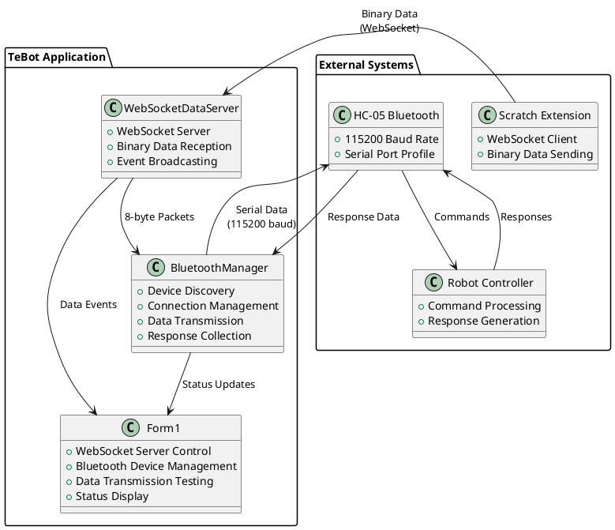
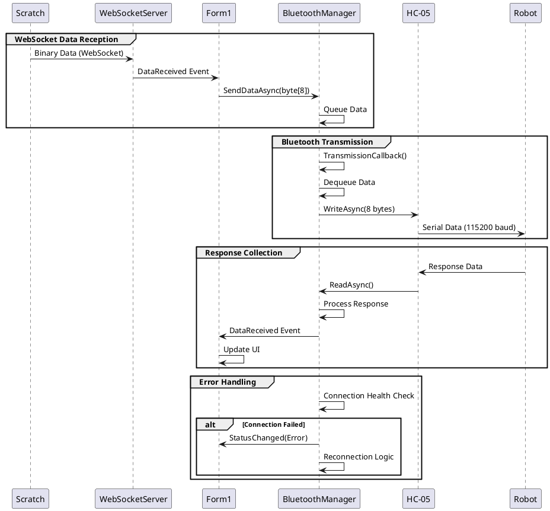
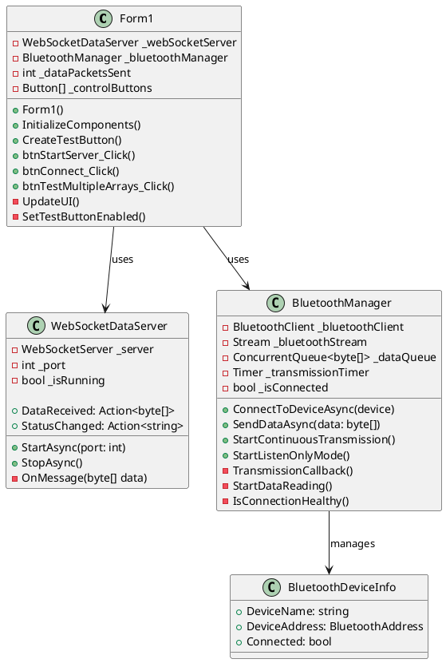
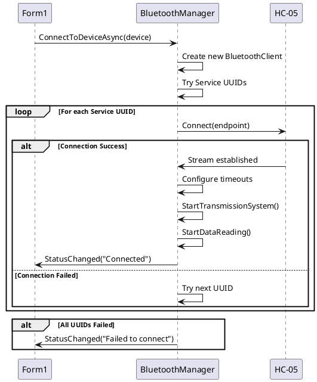
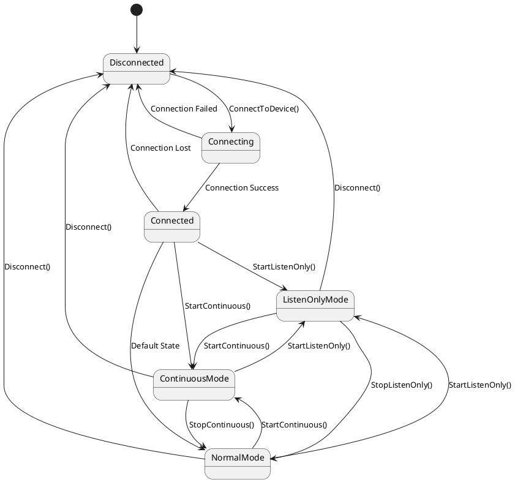
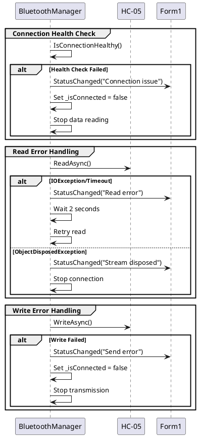
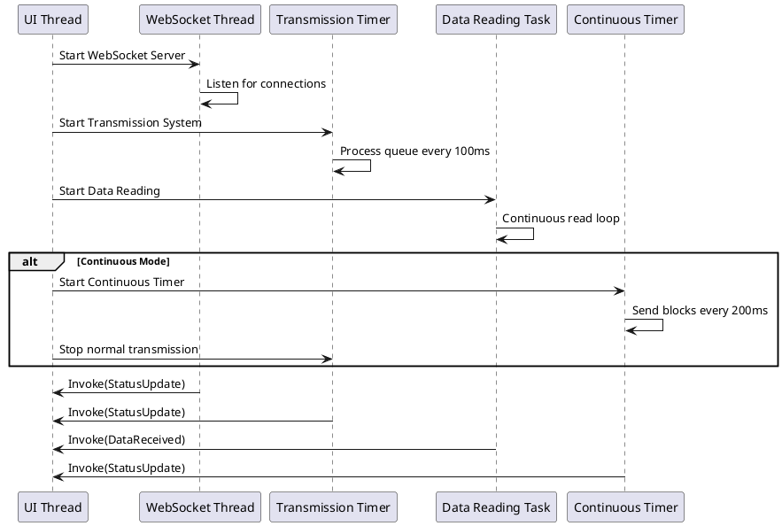

# TeBot - WebSocket to Bluetooth Bridge

## Project Overview

TeBot is a C# WinForms application that acts as a bridge between Scratch programming environment and Bluetooth-enabled robots. It receives data from Scratch via WebSocket and forwards it to robots via HC-05 Bluetooth modules, while also handling bidirectional communication.

### Key Features

- **WebSocket Server**: Receives binary data from Scratch extensions
- **Bluetooth Communication**: Connects to HC-05 modules at 115200 baud rate
- **Multi-mode Operation**: Normal, Continuous, and Listen-only modes
- **Real-time Data Processing**: Handles 8-byte data packets with minimal latency
- **Robust Error Handling**: Connection recovery and health monitoring
- **User-friendly Interface**: WinForms GUI with real-time status updates

## Architecture Overview



## Data Flow Architecture



## Class Structure



## Bluetooth Communication Protocol

### Connection Process



### Data Transmission Modes

#### 1. Normal Mode
- Sends individual 8-byte packets
- Waits for responses with 500ms timeout
- Transmission interval: 100ms

#### 2. Continuous Mode
- Sends marker (0xAA, 0x55) + 10 packets (82 bytes total)
- Transmission interval: 200ms
- Optimized for bulk data transfer

#### 3. Listen-Only Mode
- No data transmission
- Only receives and displays robot data
- Used for debugging and testing

## Configuration Constants (115200 Baud Optimized)

```csharp
// Timing Constants for 115200 baud HC-05
private const int TRANSMISSION_INTERVAL_MS = 100;        // Fast transmission
private const int RESPONSE_TIMEOUT_MS = 500;             // Quick response timeout
private const int CONTINUOUS_TRANSMISSION_INTERVAL_MS = 200;  // Continuous mode
private const int CONNECTION_TIMEOUT_MS = 10000;         // Connection attempt
private const int READ_TIMEOUT_MS = 1000;                // Data reading
private const int STREAM_TIMEOUT_MS = 5000;              // Stream operations
private const int INTER_BYTE_DELAY_MS = 0;               // No delay at 115200 baud
```

## State Machine Diagram



## Error Handling and Recovery



## User Interface Components

### Main Form Layout

```
┌─────────────────────────────────────────────────────────────────────┐
│ TeBot - WebSocket to Bluetooth Bridge                                  │
├─────────────────────────────────────────────────────────────────────┤
│ WebSocket Server                                                        │
│ [Start Server] [Stop Server]                                          │
│                                                                        │
│ Bluetooth                                      Data packets sent: 0    │
│ [Scan Devices] [Test Multiple Arrays]                                 │
│                                                                        │
│ Available Devices:                                                     │
│ [Device Dropdown ▼] [Connect] [Disconnect]                           │
│                                                                        │
│ [Start Continuous] [Stop Continuous] [Start Listen] [Stop Listen]     │
│                                                                        │
│ Status:                                                                │
│ ┌─────────────────────────────────────────────────────────────────┐   │
│ │ [Multi-line status text area with scroll]                      │   │
│ │                                                                 │   │
│ │                                                                 │   │
│ └─────────────────────────────────────────────────────────────────┘   │
└─────────────────────────────────────────────────────────────────────┘
```

### Button State Management

```plantuml
@startuml Button_States
state ServerStopped {
    btnStartServer : Enabled
    btnStopServer : Disabled
}

state ServerRunning {
    btnStartServer : Disabled
    btnStopServer : Enabled
}

state BluetoothDisconnected {
    btnConnect : Disabled
    btnDisconnect : Disabled
    btnTestMultipleArrays : Disabled
    btnStartContinuous : Disabled
    btnStopContinuous : Disabled
    btnStartListen : Disabled
    btnStopListen : Disabled
}

state BluetoothConnected {
    btnConnect : Disabled
    btnDisconnect : Enabled
    btnTestMultipleArrays : Enabled
    btnStartContinuous : Enabled
    btnStopContinuous : Disabled
    btnStartListen : Enabled
    btnStopListen : Disabled
}

state ContinuousMode {
    btnStartContinuous : Disabled
    btnStopContinuous : Enabled
    btnTestMultipleArrays : Disabled
    btnStartListen : Disabled
    btnStopListen : Disabled
}

state ListenOnlyMode {
    btnStartListen : Disabled
    btnStopListen : Enabled
    btnStartContinuous : Disabled
    btnTestMultipleArrays : Disabled
}
@enduml
```



## Performance Characteristics

### 115200 Baud Rate Performance

| Operation | Time | Description |
|-----------|------|-------------|
| Single 8-byte packet | ~0.7ms | Transmission time |
| 82-byte continuous block | ~7ms | Marker + 10 packets |
| Response timeout | 500ms | Maximum wait time |
| Transmission interval | 100ms | Between packets |
| Continuous interval | 200ms | Between blocks |

### Memory Usage

- **Data Queue**: ConcurrentQueue<byte[]> for thread-safe operations
- **Buffer Size**: 256 bytes for incoming data
- **Packet Size**: Fixed 8 bytes per data packet
- **Response Collection**: List<byte[]> with automatic cleanup

## Threading Model



## Security Considerations

1. **Bluetooth Pairing**: HC-05 modules should be paired before connection
2. **Data Validation**: All incoming data is validated for correct size (8 bytes)
3. **Connection Authentication**: Uses standard Bluetooth authentication
4. **Error Boundaries**: Robust exception handling prevents crashes

## Troubleshooting Guide

### Common Issues

1. **Connection Timeout**
   - Check HC-05 is powered and paired
   - Verify baud rate is set to 115200
   - Ensure correct COM port mapping

2. **Data Not Sending**
   - Verify connection status
   - Check transmission queue status
   - Monitor error messages in status area

3. **No Data Received**
   - Use Listen-Only mode for testing
   - Check robot is sending responses
   - Verify data format (8-byte packets)

### Diagnostic Features

- **Real-time Status**: Continuous status updates in UI
- **Debug Output**: Detailed logging to Debug console
- **Connection Health**: Automatic health monitoring
- **Queue Status**: Real-time queue size display

## Development Setup

### Prerequisites

- Visual Studio 2019 or later
- .NET Framework 4.7.2 or later
- 32feet.NET Bluetooth library
- WebSocketSharp library

### Build Configuration

```xml
<PropertyGroup>
  <TargetFramework>net472</TargetFramework>
  <Platform>AnyCPU</Platform>
  <OutputType>WinExe</OutputType>
</PropertyGroup>
```

### Dependencies

```xml
<PackageReference Include="32feet.NET" Version="3.5.0.0" />
<PackageReference Include="WebSocketSharp" Version="1.0.3-rc11" />
```

## Future Enhancements

1. **Multiple Robot Support**: Connect to multiple HC-05 modules simultaneously
2. **Data Logging**: Save transmission logs to file
3. **Configuration UI**: Runtime configuration of timeouts and intervals
4. **Protocol Extensions**: Support for different packet sizes and formats
5. **Wireless Alternatives**: WiFi and other wireless communication options

## Conclusion

TeBot provides a robust, high-performance bridge between Scratch programming environment and Bluetooth robots. The optimized 115200 baud rate configuration ensures minimal latency and maximum throughput for real-time robotics applications.
